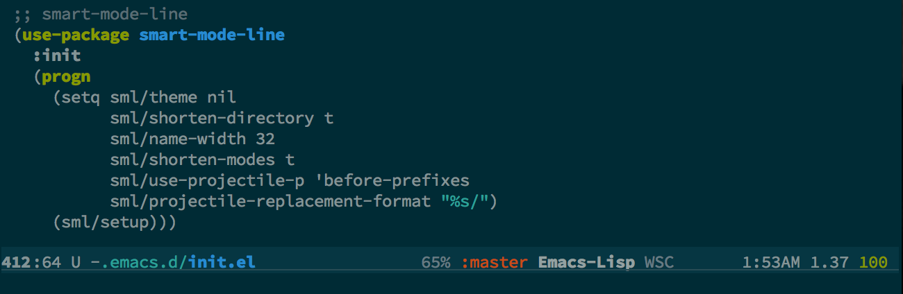
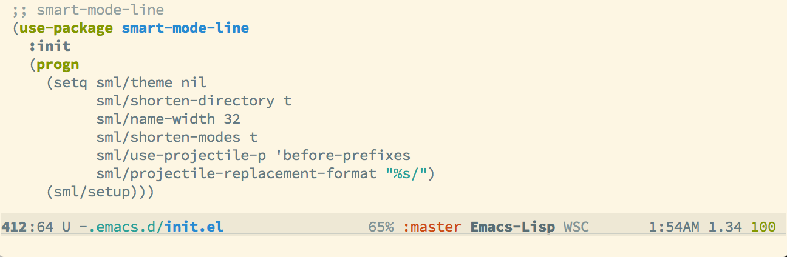

smart-mode-line  
---------------
<!--      -->
[Contribute](https://gratipay.com/Malabarba/)

Smart Mode Line is a sexy mode-line for Emacs. It aims to be easy to
read from small to large monitors by using *colors*, a *prefix feature*, and
*smart truncation*. 

Images
======
**Dark Theme**  

**Light Theme**  

**Powerline Theme**  

(Note: to use the powerline theme, install the `smart-mode-line-powerline-theme` package from MELPA)

**Solarized Dark Theme**

**Solarized Light Theme**

(Note: to use the Solarized themes, install the [`solarized-theme`](https://github.com/bbatsov/solarized-emacs/) package from MELPA)

Installation
===
**smart-mode-line** is available on Melpa, and that's the recommended
way of installing it. If you do that, you can simply activate it with:

    (sml/setup)

By default, `sml` will try to figure out the best sml theme to go with
your Emacs theme. But if you want to chose the theme yourself, do one
of the following BEFORE `sml/setup`:

    (setq sml/theme 'dark)
    (setq sml/theme 'light)
    (setq sml/theme 'respectful)

#### Installation Issues (FAQ) ####

- **Problem:** If emacs keeps warning you that *"Loading themes can
  run lisp code"* and asking *"Would you like to mark this theme as
  safe for future sessions?"*. That is probably an issue with your
  `init.el` or `.emacs` file, but we offer a workaround.
- **Solution A:** Make sure the `(custom-set-variables ...)` sexp is at
  the very top of your `.emacs` file. That is the right place for it.
  If that doesn't work, you can work around it with the code `(setq sml/no-confirm-load-theme t)`,
  but we recommend you try to figure out what's wrong with your configs.
- **Solution B:** `smart-mode-line` ships with multiple themes, and
  each must be separately marked as safe. And when `sml/apply-theme`
  is set to `automatic`, it may attempt to load a theme which you
  haven't previously loaded, causing the *"Would you like to mark this
  theme as safe..."* question to be asked again.  
  If you don't want to use the `sml/no-confirm-load-theme` variable, a
  second option is to manually cycle through all the themes and say
  "yes" to mark each of them safe. Your goal is for the
  `(custom-set-variables ...)` sexp at the top of your `.emacs` to
  contain at least three different entries under `(custom-safe-themes
  ...)`.

Features
===
Its main features include:

 1. **Color coded**:  
    Highlights the most important information for you
    (buffer name, modified state, line number). Don't
    like the colors? See item *5.*!

 2. **Fixed width** (if you want):  
    Lets you set a maxium width for the path name and mode names, and
    truncates them intelligently (truncates the directory, not the
    buffer name). Also let's you **right indent** strings in the
    mode-line (see `sml/mode-width`).

 3. **Directory as Prefixes**:  
    Prefix feature saves a LOT of space. e.g. **"~/.emacs.d/"**
    is translated to **":ED:"** in the path (open a file inside
    this folder to see it in action). Long path names you
    are commmonly working on are displayed as short
    abbreviations. Set your own prefixes to make best use
    of it (by configuring `sml/replacer-regexp-list`). Mousing
    over the abbreviated path will show you the full
    path. See below for examples.  	

 4. **Hide or Highlight minor-modes**:  
    The [rich-minority](https://github.com/Malabarba/rich-minority)
    package saves even more space. Select which minor modes you don't
    want to see listed by adding them to the variable
    `rm-excluded-modes`, or even highlight the modes that are more
    important with the variable `rm-text-properties`. This will filter
    out the modes you don't care about and unclutter the modes list
    (mousing over the modes list still shows the full list).

 5. **Very easy to configure**:  
    All colors and variables are customizable. You can change the
    whole theme with `sml/apply-theme`, or just customize anything
    manually with `sml/customize` and `sml/customize-faces`. There are
    *DOZENS* of variables to customize your mode-line, just pop over
    there and have a look!

 6. **Compatible with absolutely anything**:  
    I'm serious. Versions 2.0 and above should be compatible with
    **any** other packages that display information in the mode-line
    (evil, nyan-mode, elscreen, display-battery-mode, etc). If you
    find *ANYTHING* that does not appear as it should, file a bug report
    and I'll get to it.
    
Important Variables:
===
All variables can be edited by running `sml/customize`, and the
documentations are mostly self explanatory, I list here only the
most important ones.

 1. `sml/theme`  
  Choose what theme you want to use for the mode-line colors. For now
  there are 3 different themes: `dark`, `light`, and `respectful`.
 
 1. `sml/shorten-directory` and `sml/shorten-modes`  
  Setting both of these to `t` garantees a fixed width mode-line
  (directory name and minor-modes list will be truncated to fit). To
  actually define the width, see below.
  
 2. `sml/name-width` and `sml/mode-width`  
  Customize these according to the width of your emacs frame. I set
  them to `40` and `full` respectively, and the mode-line fits
  perfectly when the frame is split in two even on my laptop's small
  17" monitor. `full` means everything after the minor-modes will be
  right-indented.
  
 3. `sml/replacer-regexp-list`  
  This variable is a list of (REGEXP REPLACEMENT) that is used
  to parse the path. The replacements are applied
  sequentially. This allows you to greatly abbreviate the path
  that's shown in the mode-line. If this abbreviation is of
  the form **":SOMETHING:"**, it is considered a prefix and get's
  a different color (you can change what's considered a prefix
  by customizing `sml/prefix-regexp`).  
  For example, if you do a lot of work on a folder called
  **"~/Dropbox/Projects/In-Development/"** almost half the
  mode-line would be occupied just by the folder name, which
  is much less important than the buffer name. But, you can't
  just hide the folder name, since editting a file in
  **"~/Dropbox/Projects/In-Development/Source"** is VERY different
  from editting a file in **"~/Dropbox/Projects/Source"**. By
  setting up a prefix for your commonly used folders, you get
  all that information without wasting all that space. In this
  example you could set the replacement to **":ProjDev:"** or just
  **":InDev:"**, so the path shown in the mode-line will be
  **":ProjDev:Source/"** (saves a lot of space without hiding
  information).  

Some abbreviations are defined out of the box, for instance *(see the
documentation for a complete list)*:

    ("^~/\\.emacs\\.d/" ":ED:")
    ("^/sudo:.*:" ":SU:")
    ("^~/Documents/" ":Doc:")
    ("^~/Dropbox/" ":DB:")

You can stack abbreviations sequentially, by adding them in order:

    (add-to-list 'sml/replacer-regexp-list '("^~/Git-Projects/" ":Git:") t)
    (add-to-list 'sml/replacer-regexp-list '("^:Git:\(.*\)/src/main/java/" ":G/\1/SMJ:") t)

Note the `t` option ensures that your customizations are added to the
end of the list, which ensures that the second one is applied
**after** the first.

However, if you want to override one of the pre-defined abbreviations
with your own definition you need to add it to the start of the list
(note the ommited `t`):

    (add-to-list 'sml/replacer-regexp-list '("^~/Dropbox/" ":DBox:"))

Contributing
=====

